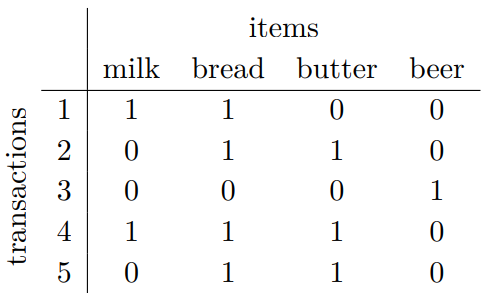
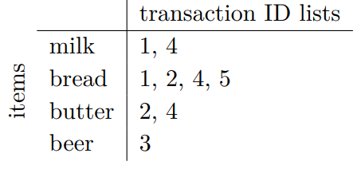

# (PART) Association Rule {-}

# Association Rule
*關聯規則(Association Rule)*的目標是找出大型資料集中**經常共同出現的物件組合**，以及這個**組合中物件的關聯性**。

所以關聯規則中要找的分別是:

* *頻繁項集(Frequent Itemsets)*: 經常一起出現的物品集合
* *關聯規則(Association Rules)*: 表達物品之間可能存在強烈的關聯性

在計算關聯規則中要定義兩個門檻來篩選得到的規則:

* *最小支持度(min Support)*: 去除不常見的
* *最小信賴度(min Confidence)*: 去除正確率低的

關聯規則中最基本的演算法分別有3個: **Apriori**, **Eclat** 和 **FP-Growth**

| |Apriori|Eclat|
|---|:---|:---|
|運算速度|慢|快|
|搜尋|廣度優先|深度優先|


<br><div class="header-cat"><h2>Some Note</h2></div><br>

<h3>apriori的進度顯示</h3>
* 在不給參數的情況下使用`apriori`會顯示個步驟的運行時間，如果不想顯示它可以用下列方法
  * 使用markdown的話可以在code chunk加入`results='hide'`來隱藏結果
  * 或是在執行apriori時加入`control = list(verbose=F)`的參數

<h3>Display results for html format</h3>
<h4>Tables</h4>
* 以表格呈現探勘出的規則
  * `arules::inspect()`: 以程式碼結果呈現，適合呈現寬度較窄的結果，較難調整輸出。
  只有這個可以用`linebreak`讓較長的規則容易比較
    * `inspect(rule)`
  
  * `arulse::DATAFRAME()`: 以表格呈現，適合只列出少數規則時使用，可以透過`format`調整輸出
    * `DATAFRAME(rule) |> format(digits=2) |> knitr::kable()`
    * `DATAFRAME(rule, separate=F)`: LHS, RHS 放同一欄位
  
  * `arulesViz::inspectDT()`: 以DT table呈現，適合想列出全部的規則時使用，可以透過`DT::table`相關程式調整輸出，預設會把篩選器(filter)放在表頭下面表格內容上面(`filter='none'`沒辦法移出它)
    * `inspectDT(rule) |> DT::formatRound(columns='count', digits=0)`

<h4>Matrix</h4>
* `pander::pander()`: pander套件可以用更好看的方式呈現矩陣，超出頁面範圍會自動截斷放到下面，因此也不適合大矩陣


<h4>Plots</h4>
* 探索資料
  * `image()`: 以矩陣圖顯示，只適合呈現小資料
  
  * `arules::itemFrequencyPlot()`: 以柱狀圖顯示交易物件中各項目的次數
    * 詳細見 [Income 範例](#IFP-ex)
    
* 探索關聯規則，詳細內容及範例結果見  [DVD 範例](#plot-ex)
  * `plot(rule, measure=c("x","y"), shading="col",control=list(jitter=6))`: 呈現每條規則的3種指標，預設繪圖引擎是`ggplot`，可以透過`ggplot2`套件中的函數調整結果
    * `x, y, col`: support, confidence, lift, order(規則的順序)
    *  透過`ggplot2`函數調整: e.g. `+ geom_point(size=3)`
  
  * `plot(rule, method="grouped")`: 呈現LHS和RHS之間的lift和support
    * 透過`control=list()`: e.g. `control=list(k=10)`
  
  * `plot(rule, method="graph")`: 呈現節點之間的lift和support

___

## Evaluation Metrics
<h3>常用指標</h3>
1. ***Support 支持度***: 衡量關聯規則**正確性** $\to$ 具有一定普遍性
$$
Support(X\to Y)=P(X\cap Y)=Support(Y\to X)\\
\color{red}{\text{不一定用機率，也可以是次數}}
$$

2. ***Confidence 信賴度***: 衡量關聯規則**顯著性**
* 非因果關係，而是換個角度看
* $P(Y|X)\approx P(X|Y)\Rightarrow$ 互補品 $\to$ 無參考價值

$$
Confidence(X\to Y)=P(Y|X)=\frac{P(X\cap Y)}{P(X)}=\frac{Support(X\to Y)}{P(X)}
$$


3. ***Lift 增益度***: 衡量關聯規則**資訊價值**  
  * 縮小定義域後的有效性
  * $Lift>1\to P(Y|X)>P(Y)\to$ 該關聯預測好 $\to$ 正相關
  * $Lift<1\to P(Y|X)<P(Y)\to$ 該關聯預測差 $\to$ 負相關

$$
Lift(X\to Y)=\frac{Confidence(X\to Y)}{P(Y)}=\frac{P(Y|X)}{P(Y)}=\frac{P(X\cap Y)}{P(X)\color{red}{P(Y)}}
$$

___

<h3>其他指標</h3>

* *Added value 附加價值*

$$
\begin{array}{ll}
AV(X\to Y)&=\frac{supp(X\to Y)}{supp(X)}-supp(Y)\\&=conf(X\to Y)-supp(Y)
\end{array}
$$

* *Conviction 信念*

$$CV(X\to Y)=\frac{1-supp(Y)}{1-conf(X\to Y)}$$

* *Leverage*: 跟lift相比，lift用的是比率，leverage用的是差(difference)
  * $Leverage=0\Rightarrow P(X\cap Y)=P(X)P(Y)\to$ A, B獨立(independent)
  * $Leverage>1\Rightarrow P(X\cap Y)>P(X)P(Y)\to$ 正相關，觀察支持度高於期望支持度
  * $Leverage<1\Rightarrow P(X\cap Y)<P(X)P(Y)\to$ 負相關，X, Y不會同時出現
  
$$
\begin{array}{ll}
Leverage(X\to Y)&=supp(X\to Y)-supp(X)\cdot supp(Y)\\
&=P(X\cap Y)-P(X)P(Y)\\
Lift(X\to Y)&=\frac{P(X\cap Y)}{P(X)P(Y)}
\end{array}
$$

___

## Example: DVD
### Prepare data
```{r message=FALSE}
library(arules)
library(arulesViz)
library(ggplot2) # for changing plot option

dat0=read.csv("data/dvdtrans.csv")
str(dat0)
factor(dat0$Item) |> levels()
```

* `split(x, f, ...)`
  * `x`: 要被分組的東西
  * `f`: 用甚麼分

```{r results='hold'}
dat=split(as.factor(dat0[,"Item"]),as.factor(dat0[,"ID"]))
knitr::kable(list(dat[[1]], dat0[dat0$ID==1,]))
```

* `itemMatrix` vs. `transactions`: 接用於表示關聯規則或交易資料，差別僅在於表示方式

```{r}
newdata=as(dat, "itemMatrix")
newdata1=as(dat, "transactions")
```

| |`itemMatrix`|`transactions`|
|---|:---|:---|
|表示|矩陣形式|列表形式|
|e.g.|||
|物件大小|`r object.size(newdata)`|`r object.size(newdata1)`|

___

```
image(x, xlab = "Items (Columns)", ylab = "Elements (Rows)", ...)
```
* 提供`image`方法給`itemMatrix`和`transactions`物件
  * x軸為項目
  * y軸為使用者

```{r}
image(newdata, main="10 transactions/customers", xlab = 'Item', ylab = 'ID')
```

___

```
itemFrequencyPlot(x, type = c("relative", "absolute"), 
                  support = NULL, topN = NULL, lift = FALSE,
                  horiz = FALSE, names = TRUE, 
                  cex.names = graphics::par("cex.axis"), ...)
```
* `type`: 預設呈現的是相對次數
* `support`: 至少多少支持度才顯示
* `topN`: 只顯示`topN`個最高次數或是增益度(`lift=TRUE`)的項目
* `horiz`: 圖形轉置
* `names`, `cex.names`: bar標籤顯示與否、字體大小

```{r}
itemFrequencyPlot(newdata) # relative freq.
```

### Mining rules
### By Apriori get rules
* `apriori(data, parameter = NULL, appearance = NULL, ...)`: Mine **frequent itemsets**, **association rules** or association hyperedges using the Apriori algorithm.
  * `data`: transactions object
  * `parameter`: named list or APparameter object
    * default
    * min support 0.1
    * min confidence 0.8
    * max length(maxlen) 10 items
    * max time(maxtime) for subset checking of 5 sec.
  * `appearance`: named list or APparameter object
    * default: all items can appear
    * set right hand side: `appearance = list(default="lhs", rhs=c("Survived=No", "Survived=Yes"))`
      * `rhs`: 右手邊顯示的特徵

```{r results='hide'}
DVD=apriori(newdata, parameter=list(support=0.1,confidence=0.1,maxlen=5))
```

* `inspect`: display rule
* `inspectDT`: display rule by `datatable` in `DT` package
* `DATAFRAME`: display rule by data.frame

```{r}
# summary(DVD)
inspectDT(DVD) |> DT::formatRound(columns='count', digits=0)
```

* `lhs`: left hand side
* `rhs`: right hand side
* `interestMeasure(x, measure, ...)`: Calculate Additional Interest Measures
  * `x`: itemsets or rules
  * `measure`: name or vector of names of the desired interest measures (see details)

```{r}
DVD@lhs@data@Dim[2] # number of rules
DT::datatable(interestMeasure(DVD, c("support","confidence", "lift")), selection = 'none')
```

#### plot results {#plot-ex}
* remind: 
  * $lift>1\to\text{good after 縮小定義域}$
  * $lift<1\to\text{bad after 縮小定義域}$

```{r message=FALSE}
plot(DVD, measure=c("confidence","lift"), shading="support",control=list(jitter=6))+
  geom_point(size=3)
```

* `order`: 規則的順序
  * order=1 $\to$ 10個 LHS為空，RHS分別為10個電影的規則
  * order=5 $\to$ 5個 LHS為4部電影的規則

```{r}
plot(DVD,measure=c("confidence","lift"),shading="order",control=list(jitter=6))+
  ggplot2::geom_point(size=3)
```

* `method = grouped`: 即`grouped matrix`，矩陣中的前因(列)使用分群(cluster)進行分組。
  組別由組中最有趣的項目('組中支持度'與'所有規則支持度'之比最高)表示。
  控制參數包含
  * `k`: 前因組的數量(預設20) $\to$ x軸
  * `rhs_max`: RHS最大數量(預設10) $\to$ y軸
  * ~~`lhs_items`: LHS項目即顯示的數量(預設2) $\to$ 超過2個以 '$+x$ items' 顯示~~ (好像沒有了 `## Warning: Unknown control parameters: lhs_items`)
  * `aggr.fun`: 聚合函數可以是從向量計算標量的任何函數(例如，min、mean(預設)、median、sum、max)。
    它也用於重新排列繪圖中的氣泡(bubble/ballon)。

```{r warning=FALSE}
plot(DVD,method="grouped")
```

* `method = graph`: 項目表示為帶有標籤的節點，規則（或項集）則表示為與項目使用箭頭連接的節點
  * 見**3.2.1.3**子集範例較清楚

```{r}
plot(head(sort(DVD,by="lift"),100),method="graph")
```

#### Check only RHS is "Patriot"

* `arules::subset(x, subset, ...)`: 用於對滿足某些條件的關聯(associations)或交易(transactions )(itemMatrix)子集進行操作(e.g. 包含特定項目或滿足最小增益度)
  * `subset`: logical expression indicating elements to keep
```{r}
DVDx <- subset(DVD,subset= rhs %in% "Patriot" & lift>1)
DATAFRAME(DVDx) |> format(digits=2) |> knitr::kable()
```

* 移除`control=list(type="items")`: 因為`## Warning: Unknown control parameters: type`

```{r}
# plot(sort(DVD,by="lift"),method="graph",control=list(type="items"))

plot(DVDx,method="grouped")
plot(DVDx,method="graph")
```

### By Eclat: Equivalence Class Clustering and bottom-up Lattice Traversal.
#### get itemset
* `eclat(data, parameter = NULL, control = NULL, ...)`: Mine **frequent itemsets** with the Eclat algorithm.
  * `data`: transactions object
  * `parameter`: named list or ECparameter object
    * default
    * support 0.1
    * maxlen 5
  * `control`: named list or ECcontrol object

```{r results='hide'}
itemsets <- eclat(newdata1, parameter = list(supp = 0.1, maxlen=5))
```
```{r}
itemsets
inspectDT(itemsets)
```

* `supportingTransactions(x, transactions)`: 查找關聯(associations)物件中每個項目集(itemset)支持(support)的對象，回傳tidLists物件
  * `x`: a set of associations (itemsets, rules, etc.)
  * `transactions`: an object of class transactions used to mine the associations in `x`.
  
```{r}
supportingTransactions(itemsets, newdata1)
```

* e.g. 第一筆表示`{Harry Potter1}`子集有出現在第1和7筆交易中

```{r}
as(supportingTransactions(itemsets, newdata1), 'list')[c(48:50)]
inspect(newdata1, linebreak=F)
```

#### get rules from itemset
* `ruleInduction(x, transactions = NULL, confidence = 0.8, method = c("ptree", "apriori"),...)`: 
  * `x`: the set of itemsets from which rules will be induced.
  * `transactions`: the transactions used to mine the itemsets. *Can be omitted for method "ptree", if x contains* a (complete set) of *frequent itemsets together with their support counts*.
  * `confidence`: minimum confidence threshold for the rules.

```{r}
## Create rules from the frequent itemsets
rules <- ruleInduction(itemsets, confidence = .1)
rules
inspectDT(rules)
```

#### get frequent itemsets with Eclat
```{r results='hide'}
## Mine frequent itemsets with Eclat.
fsets <- eclat(newdata1, parameter = list(supp = 0.2))
```
```{r}
fsets.top5 <- sort(fsets)[1:5]
inspect(fsets.top5)
as(items(fsets.top5), "list")
as(items(fsets.top5), "matrix") |> as.data.frame() |> knitr::kable(row.names = T)
```

## Example: Income
### explore data {#IFP-ex}
```{r collapse=TRUE}
IncomeESL0=read.csv("data/IncomeESL.csv")
dim(IncomeESL0)
IncomeESL=IncomeESL0[complete.cases(IncomeESL0),] # remove missing obs.
dim(IncomeESL)
```
```{r warning=FALSE}
colnames(IncomeESL) |> matrix(ncol=7) |> knitr::kable()
Income <- as(IncomeESL, "transactions")
summ <- summary(Income)
Income@itemInfo |> DT::datatable(filter = 'top')
```

* `@itemSummary`: 最頻繁項目
* `@Dim`: [rows (elements/itemsets/transactions), columns (items)]
* `@density`: 稀疏矩陣的密度

```{r}
summ@itemSummary # most frequent items
summ@Dim
summ@density
```

* 用於交易物件的函數
  * `summary(transactions)`
  * `toLongFormat(transactions)`: 轉成兩欄的data.frame，分別為ID和項目，可用`cols`重新命名
  * `items(transactions)`: 轉為`itemMatrix`
  * `transactionInfo(transactions) <- value`
  * `dimnames(transactions) <- value`

```{r}
# summary(Income)
toLongFormat(Income) |> head(5)
items(Income)
# transactionInfo(Income) |> head(3)
# dimnames(Income)
```

* `itemFrequency(x, type = c("relative", "absolute"))`: 取得所有單個項目的次數/支持度

```{r}
sort(itemFrequency(Income), decreasing = T) |> head(5)
```

```{r}
itemFrequencyPlot(Income, support=0.5, cex.names = 1.2, main='only support > 0.5')
itemFrequencyPlot(Income, topN=10, horiz=T, main='top 10 highest freq.')
```

* `las`: 標籤的方向，垂直和水平指x, y軸標籤之間
  * `0`: (預設)垂直放置
  * `1`: 水平放置
  * `2`: 垂直放置，但文字旋轉90度
  * `3`: 水平放置，但文字旋轉90度

```{r}
par(mar=c(3,13,1,1))
barplot(sort(itemFrequency(Income), decreasing=TRUE), horiz =T, las=2)
```

### get rules with apriori
```{r results='hide'}
rules <- apriori(Income, parameter = list(support = 0.2, confidence = 0.6))
summ <- summary(rules)
```

* `@quality`: 支持度、信賴度、覆蓋率(coverage)、增益度、次數的基本統計量
* `@lengths`: LHS + RHS的總項目數分布

```{r message=FALSE}
summ@quality |> knitr::kable()
summ@lengths

inspectDT(rules) |> DT::formatRound(columns='count', digits=0)
plot(rules, measure=c("confidence","lift"), shading="support")+
  geom_point(size=3)
```
```{r fig.height=8}
plot(rules, method="grouped", control=list(k=10))
```

#### Check only RHS is "householder.status=own"

```{r}
rulesOwned <- subset(rules,subset= rhs %in% "householder.status=own" & lift>1)
DATAFRAME(head(sort(rulesOwned,by="support"),n=5)) |> format(digits=2) |> knitr::kable()
```
```{r fig.height=8}
plot(rulesOwned,method="grouped")
```

## [處理多餘規則] Example: Groceries
### 基本處理
觀察資料
```{r, eval=T}
library(arules)
library(arulesViz)
data(Groceries)
itemFrequencyPlot(Groceries,topN=20)
```

取得規則
```{r results='hide'}
rules1 <- apriori(Groceries, parameter = list(supp = 0.001, conf = 0.8))
```

顯示前5個規則，小數點取到第2位
```{r}
options(digits=2)
DATAFRAME(rules1[1:5], separate=F) |> knitr::kable()
```

根據信賴度排序，由高到低
```{r groceries-tab1}
rules1 <- sort(rules1, by="confidence", decreasing=TRUE)
DATAFRAME(rules[1:5], separate=F) |> knitr::kable(caption = "Rules with top 5 highest confidence")
```

___

### 處理冗贅的規則
1. 較長的規則

從表\@ref(tab:groceries-tab1)可以看到後面幾個規則比較長，我們可以設定`maxlen`來**限制規則的長度**
```{r results='hide'}
rules2 <- apriori(Groceries, parameter = list(supp = 0.001, conf = 0.8,maxlen=3))
```
```{r}
rules2 <- sort(rules2, by="confidence", decreasing=TRUE)
DATAFRAME(rules[1:5], separate=F) |> knitr::kable()
```

___

2. 多餘的規則

有時候規則會**重複**，下面顯示的兩個規則差別在第2個規則多了"tropical fruit"，但規則2的 lift $\leq$ 規則1的 lift，表示加入"tropical fruit"對預測的提升沒有幫助，則這條規則是多餘的
```{r}
rules3 <- sort(rules1, by="lift")
options(digits=2)
subset(rules3, subset=rhs %in% "whole milk" & lift>3.7)[c(13,20)] |> 
  inspect(linebreak = T) 
```

可以用`is.subset(x,y)`判斷，x的項目如果是y項目的子集，就會回串TRUE。為了方便呈現整體因此先隱藏行列的名稱

**主對角線皆為T**，因為自己是自己的子集。
從下面的結果可以看到，在(12,20)和(13,20)處是T，表示第12, 13列的項目是第20行的子集。
詳細內容見表\@ref(tab:groceries-tab2)
```{r}
rules4 <- subset(rules3, subset=rhs %in% "whole milk" & lift>3.7)
subset.matrix <- is.subset(rules4, rules4)
subset.matrix1 <- as.matrix(subset.matrix)
subset.matrix |> unname()
```
```{r groceries-tab2}
target <- subset.matrix1[c(12,13),20] |> matrix(nrow=2)
colnames(target) <- colnames(subset.matrix1)[20]
rownames(target) <- rownames(subset.matrix1)[c(12,13)]
target |> knitr::kable(emphasize.rownames=F, caption="Redudant rules")
```

移除下三角的矩陣，**包含對角線**
```{r}
subset.matrix1[lower.tri(subset.matrix1, diag=T)] <- NA
subset.matrix1[1:5,1:5] |> unname()
```

計算每行中TRUE的個數，如果有一個(含)以上，表示它是多餘的規則
從表\@ref(tab:groceries-tab2)可以看到`r colnames(subset.matrix1)[20]`，有兩個TRUE，表示它有其它的子集，因此它是多餘的
```{r}
redundant <- colSums(subset.matrix1, na.rm=T) >= 1
sum(redundant)
```

我們發現了`r sum(redundant)`條多餘的規則，移除它並檢查是否有成功
```{r}
rules.pruned <- rules4[!redundant]
summary(rules4)@lengths
summary(rules.pruned)@lengths
```

