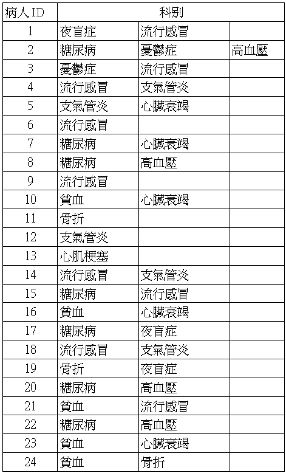
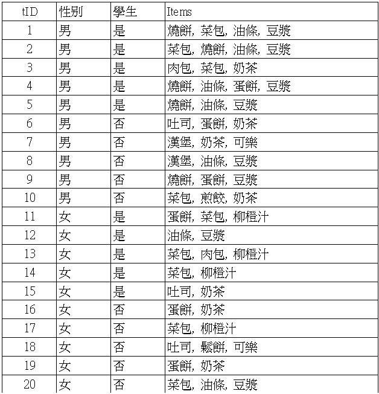

# Self-learning

```{r results='hide', warning=FALSE, message=FALSE}
library(arules)
library(arulesViz)
library(ggplot2)
library(cowplot)
library(kableExtra)
library(huxtable)
```

表格輸出設定，因為`gitbook`會把寬的表格給cut掉

```{r}
print.rule.table <- function(rule, sub=F, ...,
                             sort=T, sortBy='lift', 
                             all=F, headN=5,
                             select=F, selected, 
                             digits=2, scroll=F, kable=T){
  if(sub) out <- subset(rule, ...) else out <- rule
  if(length(out)==0) message('no rules in this condition.') else {
    if(sort) out <- sort(out, by=sortBy) else out <- rule
    if(all) out <- out else out <- head(out, headN) 
    if(select){
      if (missing(selected)) warning("selected column should be specified.") else 
        out <- DATAFRAME(out)[, c("LHS", "RHS", selected)]
    } else out <- DATAFRAME(out)
    if(kable){
      out <- format(out, digits=digits) |> knitr::kable()
      if(scroll){
        out <- out |>
          kable_styling() |>
          scroll_box(width = "100%", box_css = "border: 0px;")
      }
    } else out <- format(out, digits=digits)
    return(out)
  }
}
```

比較不同的規則，列出相同條件下，不同方法取出的規則

```{r}
compare.rule <- function(rule1, rule2, ...){
  row1 <- subset(rule1@quality, ...) |> rownames()
  row2 <- subset(rule2@quality, ...) |> rownames()
  list(rule1[row1], rule2[row2])
}
```

映射滿足條件的欄位

```{r}
mapping <- function(df, rangeVec, tagetCol){
  df |>
    as_hux() |>
    map_background_color(everywhere, tagetCol, 
                         by_ranges(rangeVec, c(NA, '#FEF9E7', NA))) |> 
    map_text_color(everywhere, tagetCol, 
                   by_ranges(rangeVec, c(NA, '#212F3C', NA)))
}
```

## check details of `Income` data set

Using package dataset "Income", and check package PDF manual for details, and explain the code via markdown.

-   `Income`: 交易物件(transactions object)，包含6876筆交易、50個項目(隸屬於14個變數)
    -   `income`, `sex`, `marital status`, `age`, `education`, `occupation`, `years in bay area`, `dual incomes`, `number in household`, `number of children`, `householder status`, `type of home`, `ethnic classification`, `language in home`
-   資料處理:
    -   **1.** 移除包含遺失值的資料
    -   **2.** 以中位數將順序尺度(ordinal)變數分為兩類

```{r}
data("IncomeESL")
cum.freq <- function(df){
  var.ord.fac <- sapply(df, is.ordered)
  sapply(df[,var.ord.fac], table)
}
cum.freq(IncomeESL)

## remove incomplete cases
IncomeESL <- IncomeESL[complete.cases(IncomeESL), ]

## preparing the data set
IncomeESL[["income"]] <- factor((as.numeric(IncomeESL[["income"]]) > 6) +1,
  levels = 1 : 2 , labels = c("$0-$40,000", "$40,000+"))
	  
IncomeESL[["age"]] <- factor((as.numeric(IncomeESL[["age"]]) > 3) +1,
  levels = 1 : 2 , labels = c("14-34", "35+"))

IncomeESL[["education"]] <- factor((as.numeric(IncomeESL[["education"]]) > 4) +1,
  levels = 1 : 2 , labels = c("no college graduate", "college graduate"))

IncomeESL[["years in bay area"]] <- factor(
  (as.numeric(IncomeESL[["years in bay area"]]) > 4) +1,
  levels = 1 : 2 , labels = c("1-9", "10+"))

IncomeESL[["number in household"]] <- factor(
  (as.numeric(IncomeESL[["number in household"]]) > 3) +1,
  levels = 1 : 2 , labels = c("1", "2+"))

IncomeESL[["number of children"]] <- factor(
  (as.numeric(IncomeESL[["number of children"]]) > 1) +0,
  levels = 0 : 1 , labels = c("0", "1+"))
	
##  creating transactions
Income <- transactions(IncomeESL)
```

```{r}
data("Income")
Income@itemInfo |> DT::datatable(filter = 'top')
```

## [compare different grouping] regroup income into 2 levels

Use "IncomeESL", merge income into two levels c("\$40-","\$40+"). Compare your results.

-   重新切分 $\to$ 類似商品層級
    -   e.g. 衣服 $\to$ 長袖、短袖、外套、...

### explore data

對 income 變數進行重新分組，該變數共9組，各組個數如下

```{r}
data("IncomeESL")
levels(IncomeESL[["income"]])
table(IncomeESL[["income"]])
```

比較把 income 重新分為2組(\$40-, \$40+)和3組(\$20-, \$20-\$40, \$40+)對探勘關聯規則有甚麼影響

```{r}
df.2g <- df.3g <- IncomeESL
df.2g[["income"]] <- factor((as.numeric(df.2g[["income"]]) > 6) +1, levels = 1:2 , labels = c("$40-", "$40+"))
# table(df.2g$income)
Income.2g <- as(df.2g, 'transactions')

df.3g[["income"]] <- factor(
  ifelse(as.numeric(df.3g[["income"]]) < 4, 1, 
         ifelse(as.numeric(df.3g[["income"]]) < 7, 2, 3)), 
  levels = 1:3 , labels = c("$20-", "$20-$40", "$40+"))
# table(df.3g$income)
Income.3g <- as(df.3g, 'transactions')
```

-   下面兩張圖分別是 income 分成2組和3組時，次數最多的10個項目，主要差別用紅線標記
    -   分成2組時，income = \$40- 為第2高
    -   分成3組時，income 沒有在前10名內

```{r fig.height=8}
par(mfrow=c(2,1), mar=c(4,3,1,1))
itemFrequencyPlot(Income.2g, topN=10, horiz=T, main='top 10 highest freq. with 2 group income')
abline(h=1.9, col='red')
itemFrequencyPlot(Income.3g, topN=10, horiz=T, main='top 10 highest freq. with 3 group income')
abline(h=10.3, col='red')
```

### explore rule

-   設定最小支持度為0.4、信賴度0.5: 保留常見的規則

```{r results='hide'}
rule.2g <- apriori(Income.2g, parameter = list(support = 0.4, confidence = 0.5))
rule.3g <- apriori(Income.3g, parameter = list(support = 0.4, confidence = 0.5))
```

-   不同項目集個數的規則數 (RHS+LHS)
    -   2組: 38個規則
    -   3組: 28個規則

```{r}
summary(rule.2g)@lengths
summary(rule.3g)@lengths
```

<hr>

<ul>

<li class="downarrow">

以增益度(lift)排序，顯示前5高的規則

<ul>

<li>兩種分組的前2個規則相同</li>

</ul>

</li>

</ul>

```{r results='hold'}
print.rule.table(rule.2g, scroll = T)
print.rule.table(rule.3g, scroll = T)
```

<hr>

<ul>

<li class="downarrow">

分成2組(上)和3組(下)時的分布圖

<ul>

<li>多出來的10個規則大概分布在信賴度 = 0.65 和 0.75 處</li>

</ul>

</li>

</ul>

```{r}
par(mfrow=c(2,1), mar=c(3,3,1,1))
p1 <- plot(rule.2g, measure=c("confidence","lift"), shading="support")+
  geom_point(size=3) + geom_hline(yintercept = 1, col='blue')
p2 <- plot(rule.3g, measure=c("confidence","lift"), shading="support")+
  geom_point(size=3) + geom_hline(yintercept = 1, col='blue')
plot_grid(p1, p2, nrow=2)
```

<hr>

<ul>

<li class="downarrow">

檢視信賴度Range=(0.7, 0.8)且增益度Range=(1.1, 1.3)處的規則(目測約5個)

<ul>

<li>分成2組多出的規則為前4筆</li>

</ul>

</li>

</ul>

```{r results='hold'}
results <- compare.rule(rule.2g, rule.3g, confidence>0.7 & confidence<0.8 & lift>1.1 & lift<1.3)
print.rule.table(results[[1]], all=T, scroll=T)
print.rule.table(results[[2]], all=T, scroll=T)
```

## [compare different algorithm] mine rule of `AdultUCI` data set

> 因為`fim4r`載不了，所以只比較`apriori`和`eclat`

Importing built-in data "AdultUCI" and mining rules

### details of data

```{r echo=FALSE}
data("AdultUCI")
med1 <- median(AdultUCI[["capital-gain"]][AdultUCI[["capital-gain"]] > 0])
g1 <- names(table(cut(AdultUCI[["capital-gain"]], c(-Inf,0,median(AdultUCI[["capital-gain"]][AdultUCI[["capital-gain"]] > 0]), Inf))))
med2 <- median(AdultUCI[["capital-loss"]][AdultUCI[["capital-loss"]] > 0])
g2 <- names(table(cut(AdultUCI[["capital-loss"]], c(-Inf,0,median(AdultUCI[["capital-loss"]][AdultUCI[["capital-loss"]] > 0]), Inf))))
```

-   `AdultUCI`資料包含成人資料庫(人口普查收入資料庫)的問卷資料，包含
    -   48,842個觀察值
    -   15個變數: `r colnames(AdultUCI)`
-   `Adult`資料為交易物件，包含
    -   48,842筆交易
    -   115個項目
-   資料處理如下
    -   移除連續特徵`fnlwgt`(final weight)
    -   移除`education-num`，因為它只是`education`的數值表示
    -   年齡(age)分為`Young`(0-25), `Middle-aged`(26-45), `Senior`(46-65)和`Old`(66+)
    -   每周工作時間(hours-per-week)分為`Part-time`(0-25), `Full-time`(25-40), `Over-time`(40-60)和`Too-much`(60+)
    -   資本收益和損失(capital-gain / capital-loss)分為`None`(0), `Low`(0 \< 大於0的數值之中位數 \< 最大值) and `High`( $\geq$ 最大值)
        -   capital-gain: 大於0的數值之中位數=`r med1`，分組為`r g1`
        -   capital-loss: 大於0的數值之中位數=`r med2`，分組為`r g2`

```{r eval=FALSE}
data("AdultUCI")
## remove attributes
AdultUCI[["fnlwgt"]] <- NULL
AdultUCI[["education-num"]] <- NULL

## map metric attributes
# min=17, max=90
AdultUCI[["age"]] <- ordered(cut(AdultUCI[["age"]], c(15, 25, 45, 65, 100)),
  labels = c("Young", "Middle-aged", "Senior", "Old"))

# min=1, max=99
AdultUCI[["hours-per-week"]] <- ordered(cut(AdultUCI[["hours-per-week"]],
  c(0,25,40,60,168)),
  labels = c("Part-time", "Full-time", "Over-time", "Workaholic"))

# min=0, max=99999
AdultUCI[["capital-gain"]] <- ordered(cut(AdultUCI[["capital-gain"]],
  c(-Inf,0,median(AdultUCI[["capital-gain"]][AdultUCI[["capital-gain"]] > 0]), Inf)), labels = c("None", "Low", "High"))

AdultUCI[["capital-loss"]] <- ordered(cut(AdultUCI[["capital-loss"]],
  c(-Inf,0, median(AdultUCI[["capital-loss"]][AdultUCI[["capital-loss"]] > 0]), Inf)), labels = c("None", "Low", "High"))

## create transactions
Adult <- transactions(AdultUCI)
```

-   `cut(x, breaks, ...)`: 把`x`切分成不同的區間

```{r}
tx0 <- c(9, 4, 6, 5, 3, 10, 5, 3, 5)
x <- rep(0:8, tx0)
table(cx  <- cut(x, breaks = 2*(0:4)))
table(cxl <- cut(x, breaks = 2*(0:4), right = FALSE))
```

### explore data

-   出現最多次的是資本損失和收益為無，接著是出生地為美國，種族為白人(因為是美國的人口普查)

```{r}
data("Adult")
itemFrequencyPlot(Adult, topN=10, horiz=T, main='top 10 highest freq.')
```

### explore rule

-   設定最小支持度為0.4、信賴度0.5: 保留常見的規則

```{r results='hide'}
calc.time <- function(code){
  set.seed(123)
  t1 <- Sys.time()
  code
  t2 <- Sys.time()
  return(t2-t1)
}
# Apriori
# rule.apriori <- apriori(Adult, parameter = list(support = 0.4, confidence = 0.5))
t1 <- calc.time(rule.apriori <- apriori(Adult, parameter = list(support = 0.4, confidence = 0.5)))

# Eclat
itemset.eclat <- eclat(Adult, parameter = list(supp = 0.4, maxlen=5))
# rule.eclat <- ruleInduction(itemset.eclat, confidence = 0.5)
t2 <- calc.time(rule.eclat <- ruleInduction(itemset.eclat, confidence = 0.5))

# FP-Growth
# rule.fpgrowth <- fim4r(Adult, method = "fpgrowth", target = "rules", supp = .7, conf = .8)
```

-   兩種演算法的運算時間

| Algorithm | Time (sec)       |
|:----------|:-----------------|
| apriori   | `r round(t1, 5)` |
| eclat     | `r round(t2, 5)` |

<hr>

<ul>

<li class="downarrow">

apriori 和 eclat 的分布圖

<ul>

<li>無明顯差異</li>

</ul>

<ul>

<li><strong>相差 9 個規則</strong></li>

</ul>

</li>

</ul>

```{r message=FALSE}
p1 <- plot(rule.apriori, measure=c("confidence","lift"), shading="support")+
  geom_point(size=3) + scale_colour_gradient(low='steelblue1', high='firebrick1', limits=c(0.4,1))
p2 <- plot(rule.eclat, measure=c("confidence","lift"), shading="support")+
  geom_point(size=3) + scale_colour_gradient(low='steelblue1', high='firebrick1', limits=c(0.4,1))
plot_grid(p1, p2, nrow=2)
```

<hr>

<ul>

<li class="downarrow">

以支持度 (support) 排序，顯示前5高的規則

<ul>

<li><strong>eclat 的 LHS 沒有空集合</strong></li>

</ul>

<ul>

<li>eclat 沒有 count 和 coverage</li>

</ul>

</li>

</ul>

```{r results='hold'}
print.rule.table(rule.apriori, sortBy = 'support')
print.rule.table(rule.eclat, sortBy = 'support')
```

<hr>

<ul>

<li class="downarrow">

以信賴度 (confidence) 排序，顯示前5高的規則

<ul>

<li>兩種演算法的規則相同</li>

</ul>

</li>

</ul>

```{r results='hold'}
print.rule.table(rule.apriori, sortBy = 'confidence', scroll = T)
print.rule.table(rule.eclat, sortBy = 'confidence')
```

<hr>

<ul>

<li class="downarrow">

以增益度 (lift) 排序，顯示前5高的規則

<ul>

<li>兩種演算法的規則相同</li>

</ul>

</li>

</ul>

```{r results='hold'}
print.rule.table(rule.apriori, sortBy = 'lift', scroll = T)
print.rule.table(rule.eclat, sortBy = 'lift')
```

### conclusion

<ul>

<li class="downarrow">

apriori 比 eclat 多出來的 9 個規則為 LHS 是空集合的規則

</li>

</ul>

```{r}
rule.apriori[size(lhs(rule.apriori))==0] |> 
  print.rule.table(all=T)
```

-   相同條件下 eclat 的運算速度較快

## 就診紀錄

下表紀錄了24位患者近兩年內的就診紀錄，請根據資料回答下列問題\


```{r warning=FALSE}
df <- read.csv('data/RA HW1-1.csv', encoding = 'UTF-8')
colnames(df) <- c('ID', paste0('sick', seq(3)))

library(reshape2)
df <- melt(df, id="ID")
df <- df[,-2]
df <- df[!df$value=="",]
```

<ul>

<li class="downarrow">

共 10 種疾病

</li>

</ul>

```{r}
unique(df$value)
```

<ul>

<li class="downarrow">

資料框架(左) vs. 交易物件(右) 以第2個病人為例

</li>

</ul>

```{r}
dat=split(as.factor(df$value),as.factor(df$ID))
sick <- transactions(dat)
knitr::kable(list(df[df$ID==2,], DATAFRAME(sick) |> head(3)))
```

<ul>

<li class="downarrow">

以支持度最低為 0.1、信賴度最低為 0.01、項目集最多 3 個，探勘規則

</li>

</ul>

```{r results='hide'}
rule <- apriori(sick, parameter = list(support=0.1, confidence=0.01, maxlen=3))
```

<ul>

<li class="downarrow">

總共 `r nrow(rule@quality)` 條，包含 1 個項目的規則 8 條，包含 2 個項目的規則 6 條

</li>

</ul>

```{r results='hold'}
rule
summary(rule)@lengths
# inspectDT(rule) |> DT::formatRound(columns='count', digits=0)
```

------------------------------------------------------------------------

(1) 請列出所有的 k=1 項目集，並計算其支持度。\

```{r}
rule[size(lhs(rule))==0] |> 
  print.rule.table(sortBy = 'support', all=T) |>
  column_spec(4, color = '#212F3C', background = '#FEF9E7')
```

------------------------------------------------------------------------

(2) 在 k=2 項目集中，請列出包含「糖尿病」之項目集與其所對應的支持度。\

```{r}
rule[size(lhs(rule))+size(rhs(rule))==2] |>
  subset(subset=lhs %in% '糖尿病' | rhs %in% '糖尿病') |> 
  print.rule.table(all=T, sort = F) |>
  column_spec(4, color = '#212F3C', background = '#FEF9E7')
```

------------------------------------------------------------------------

(3) 在 k=3 項目集中，請找出所有支持度高於0.2之規則。

<ul>

<li class="downarrow">

支持度最低 0.1、信賴度最低 0.01 下沒有 k=3 的項目集

</li>

</ul>

```{r}
rule[size(lhs(rule))+size(rhs(rule))==3]
```

<ul>

<li class="downarrow">

放寬條件，找出 k=3 的項目集，沒有支持度高於 0.2 的規則

</li>

</ul>

```{r results='hide'}
rule1 <- apriori(sick, parameter = list(support=0.001, confidence=0.001))
```

```{r}
summary(rule1)@lengths
rule1[size(lhs(rule1))+size(rhs(rule1))==3] |>
  print.rule.table(all=T) |>
  column_spec(4, color = '#212F3C', background = '#FEF9E7')
```

------------------------------------------------------------------------

(4) 根據(3)所找出之高頻項目集，請計算「糖尿病」對於同項目集中之另一項目之信賴度與增益。假設信賴度的門檻值為0.4，在此是否存在任何顯著之關聯規則？

k=3 項目集為 {憂鬱症, 糖尿病, 高血壓}

<ul>

<li class="downarrow">

信賴度最低 0.4 下，{糖尿病} $\to$ {高血壓}為顯著的關聯規則

</li>

</ul>

```{r}
options(huxtable.bookdown = FALSE)
rule1[size(lhs(rule1))+size(rhs(rule1))==2] |>
  subset(rule1, subset = lhs %oin% "糖尿病" & rhs %in% c("憂鬱症", "高血壓")) |> 
  DATAFRAME() |>
  mapping(c(0.4, 1.1), "confidence")
```

------------------------------------------------------------------------

(5) 請將(2)、(3)、(4)中之項目「糖尿病」依次替換為「貧血」、「高血壓」、「憂鬱症」、「夜盲症」與「流行感冒」，探討是否有任何顯著之關聯規則可被建立。

放寬條件後，k=3 項目集只有 {憂鬱症, 糖尿病, 高血壓}

<ul>

<li class="downarrow">

信賴度最低 0.4 下，顯著的關聯規則有:

<ul>

<li>{糖尿病} $\to$ {高血壓} (Q4.)</li>

<li>{憂鬱症} $\to$ {高血壓}</li>

<li>{憂鬱症} $\to$ {糖尿病}</li>

<li>{高血壓} $\to$ {糖尿病}，conf = 1 表示有看高血壓的病人都有看過糖尿病 (obs. 2, 8, 20, 22)</li>

</ul>

</li>

</ul>

```{r echo=FALSE}
rule1[size(lhs(rule1))+size(rhs(rule1))==2] |>
  subset(rule1, subset = lhs %oin% "憂鬱症" & rhs %in% c("糖尿病", "高血壓")) |>
  DATAFRAME() |> 
  mapping(c(0.4, 1.1), "confidence")
rule1[size(lhs(rule1))+size(rhs(rule1))==2] |>
  subset(rule1, subset = lhs %oin% "高血壓" & rhs %in% c("憂鬱症", "糖尿病")) |>
  DATAFRAME() |> 
  mapping(c(0.4, 1.1), "confidence")
```

------------------------------------------------------------------------

$$
conf(X\to Y)=\frac{P(X\cap Y)}{P(X)}>0.4\\
\Rightarrow P(X\cap Y)>0.4\cdot P(X)
$$

因此$sup(X\to Y)$至少要$0.4\cdot P(X)$

<ul>

<li class="downarrow">

計算$sup(X)\cdot0.4$，得到support至少要0.0168

</li>

</ul>

```{r echo=FALSE}
target <- rule1[size(lhs(rule1))==0] |> print.rule.table(sortBy = 'support', all=T, kable = F)
target$lower <- as.numeric(target$support)*0.4
target[,c("RHS", "support", "lower")] |> knitr::kable()
```

<ul>

<li class="downarrow">

找 k=2 且 support最低0.015

</li>

</ul>

```{r results='hide', warning=FALSE}
tmp <- apriori(sick, parameter = list(support=0.015, confidence=0.001, minlen=2, maxlen=2))
```

```{r}
print.rule.table(tmp, sub=T, confidence>0.4, all=T, sortBy = 'confidence') |>
  column_spec(5, color = '#212F3C', background = '#FEF9E7')
```

## 早餐店購買紀錄

下表為某早餐店所統計之顧客交易紀錄，請根據資料回答下列問題 

```{r warning=FALSE}
df <- read.csv('data/RA HW1-2.csv', encoding = 'UTF-8')
colnames(df) <- c('ID', "sex", "stu", "items")

items <- lapply(strsplit(df$items, ","), 
                function(x) gsub(" ", "", x))

target <- df[rep(1:nrow(df), times = lengths(items)), -4]
for(i in 1:nrow(target)){
  target$item[i] <- unlist(items)[i]
}
```

<ul>

<li class="downarrow">

共 13 種餐點

</li>

</ul>

```{r}
unique(target$item)
```

<ul>

<li class="downarrow">

資料框架(左) vs. 交易物件(右) 以第3個客人為例

</li>

</ul>

```{r}
dat=split(as.factor(c(target$item, target$sex, target$stu)),
          as.factor(target$ID))
breakfast <- transactions(dat)
knitr::kable(list(df[df$ID==3,], DATAFRAME(breakfast) |> head(3)))
```

<ul>

<li class="downarrow">

以支持度最低為 0.2、信賴度最低為 0.5、項目集最多 3 個，**"性別"及"是否為學生"不會出現在右手邊**，探勘規則

</li>

</ul>

```{r results='hide', warning=FALSE}
rule <- apriori(breakfast, 
                parameter = list(support=0.2, confidence=0.5, maxlen=3),
                appearance = list(default="lhs", 
                                  rhs=unique(target$item)))
```

<ul>

<li class="downarrow">

總共 `r nrow(rule@quality)` 條，包含 2 個項目的規則 8 條，包含 3 個項目的規則 3 條

</li>

</ul>

```{r results='hold'}
rule
summary(rule)@lengths
```

------------------------------------------------------------------------

(1) 請列出所有的 k=1 項目集，並計算其支持度。\

```{r}
barplot(itemFrequency(breakfast) |> sort(decreasing = T), horiz = T, las=2)
```

------------------------------------------------------------------------

(2) 在k=2 項目集中，請找出所有支持度高於0.2之規則。

```{r}
rule[size(lhs(rule))+size(rhs(rule))==2] |>
  print.rule.table(all=T, sortBy = "support") |>
  column_spec(4, color = '#212F3C', background = '#FEF9E7')
```

------------------------------------------------------------------------

(3) 在k=3 項目集中，請找出所有支持度高於0.2之規則。\

```{r}
rule[size(lhs(rule))+size(rhs(rule))==3] |>
  print.rule.table(all=T, sortBy = "support") |>
  column_spec(4, color = '#212F3C', background = '#FEF9E7')
```

------------------------------------------------------------------------

(4) 假設支持度門檻為0.2，信賴度門檻為0.5，請論述「菜包 $\to$ 柳橙汁」之規則是否成立？
(5) 承題(4)，請論述「燒餅」 $\to$ 「油條」、「豆漿」之規則是否成立？\

```{r}
print.rule.table(rule, all=T, sortBy = "support")
```

支持度門檻為0.2，信賴度門檻為0.5下，沒有「菜包 $\to$ 柳橙汁」和「燒餅 $\to$ 油條、豆漿」的規則

------------------------------------------------------------------------

(6) 假設將分析範圍鎖定為男性顧客，請分別論述題(4) \~ (5)之規則是否成立？反之，若鎖定女性顧客，題(4) \~ (5)規則之成立性又為如何？\
(7) 假設將分析範圍鎖定為非學生之顧客，請分別論述(4) \~ (5)之規則是否成立？反之，若鎖定學生顧客，題(4) \~ (5)規則之成立性又為如何？

------------------------------------------------------------------------

***Notice***: 設定右手邊只會出現餐點後，餐點好像不會出現在左手邊

<ul>

<li class="downarrow">

調低門檻值

</li>

</ul>

```{r results='hide'}
test1 <- apriori(breakfast, 
                 parameter = list(support=0.01, confidence=0.01, maxlen=3),
                 appearance = list(default="lhs", rhs=unique(target$item)))
```

```{r}
test1[size(lhs(test1))+size(rhs(test1))==2] |>
  print.rule.table(all=T, sortBy = "support")
```

<ul>

<li class="downarrow">

沒辦法設定兩邊

</li>

</ul>

```{r}
tryCatch(
  expr = {
    test2 <- apriori(breakfast, 
                 parameter = list(support=0.01, confidence=0.01, maxlen=3),
                 appearance = list(
                   lhs=unique(c(target$item, target$sex, target$stu)),
                   rhs=unique(target$item)))
  },
  error = function(e) {
    print(paste("Error：", e$message))
  }
)
```

<ul>

<li class="downarrow">

改設定左手邊，發現沒有規則，可能是因為沒有東西能放右手邊了

</li>

</ul>

```{r results='hide'}
test3 <- apriori(breakfast, 
                 parameter = list(support=0.01, confidence=0.01, maxlen=3),
                 appearance = list(
                   lhs=unique(c(target$item, target$sex, target$stu)),
                   default="rhs"))
```

```{r}
test3
```

## Groceries data

```{r}
library(arules)
library(arulesViz)
```

### ??? $\rightarrow$ item

1.  What are customers likely to buy before buying whole milk?

```{r}
data("Groceries")
rules<-apriori(data=Groceries, parameter=list(supp=0.001,conf = 0.08), 
               appearance = list(default="lhs",rhs="whole milk"),
               control = list(verbose=F))
rules<-sort(rules, decreasing=TRUE,by="confidence")
DATAFRAME(rules[1:5], separate=F) |> format(digits=2) |> knitr::kable()
```

### item $\rightarrow$ ???

2.  What are customers likely to buy if they purchase whole milk?

```{r}
rules<-apriori(data=Groceries, parameter=list(supp=0.001,conf = 0.15,minlen=2), 
               appearance = list(default="rhs",lhs="whole milk"),
               control = list(verbose=F))
rules<-sort(rules, decreasing=TRUE,by="confidence")
DATAFRAME(rules[1:5], separate=F) |> format(digits=2) |> knitr::kable()
```
