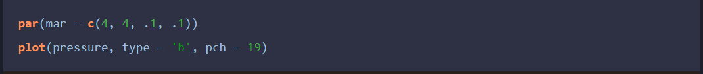
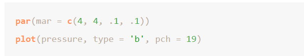
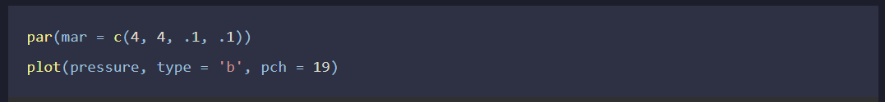
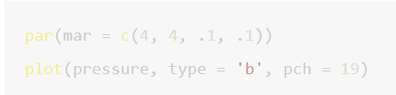

--- 
title: "Recommender System"
author: "ZIH-YING, LI"
site: bookdown::bookdown_site
documentclass: book
---

```{r setup, include=FALSE}
knitr::opts_chunk$set(
  # eval=F,
  warning=FALSE,
  message=FALSE,
  fig.align = "center",
  fig.height = 6,
  fig.width = 12
)
library(knitr)
library(pander)
```

# About {-}

Personal note for *Recommender System* Course

* Item-based
  * Association, Market basket models
  * Frequent item
* Rating-based: 資料含使用者評分
  * Content filtering: user獨立
  * Collaborative filtering: 分群，補缺值，推高評分的item給user
* Hybrid Models: 組合預測，n個模型的結果平均起來，有點像隨機森林
* Model-based
* Knowledge-based

___

* Reference Book
  * *Charu C. Aggarwal*, Recommender Systems: The Textbook.

___

* Using package in R
  * 推薦系統
    * 關聯規則: [`arules`](https://cran.r-project.org/web/packages/arules/arules.pdf), `arulesViz`
      * FP-Growth: [`rCBA`](https://search.r-project.org/CRAN/refmans/rCBA/html/fpgrowth.html) (因為`arules::fim4r`用不了)
    * 協同過濾: [`recommenderlab`](https://cran.r-project.org/web/packages/recommenderlab/recommenderlab.pdf)
  * 其他
    * 調整圖形輸出: `ggplot2`
    * [多圖排列](https://cran.r-project.org/web/packages/egg/vignettes/Ecosystem.html): `cowplot`, `gridExtra`
    * html表格(kable)調整: `kableExtra`
    * html表格(kable)映射(mapping): `huxtable`
    * 資料處理: `dplyr`

___

* Reference
  * **Data**
    * [MovieLens](https://grouplens.org/datasets/movielens/)

  ___

  * **Conjoint Analysis**
    * [Conjoint Analysis in 10 minutes - Business Performance Management](https://www.youtube.com/watch?v=yiRNcHU2ZGU)
    * [Conjoint Analysis in R: A Marketing Data Science Coding Demonstration](https://www.data-mania.com/blog/conjoint-analysis-in-r/)
    * [How to Manually Calculate Partworth Utilities](https://conjointly.com/guides/how-to-calculate-partworth-utilities/)
    
  * **Association Rule**
    * [Association mining — Leverage in Python](https://medium.com/@24littledino/association-mining-leverage-in-python-86b0e476edeb)
    * [R_programming - (7)關聯式規則(Association rule)](https://rpubs.com/allan811118/R_programming_07)
    * 處理多餘的規則、規則右手邊顯示的特徵: [Machine Learning -關聯分析-Apriori演算法-詳細解說啤酒與尿布的背後原理 Python實作-Scikit Learn一步一步教學](https://chwang12341.medium.com/machine-learning-%E9%97%9C%E8%81%AF%E5%88%86%E6%9E%90-apriori%E6%BC%94%E7%AE%97%E6%B3%95-%E8%A9%B3%E7%B4%B0%E8%A7%A3%E8%AA%AA%E5%95%A4%E9%85%92%E8%88%87%E5%B0%BF%E5%B8%83%E7%9A%84%E8%83%8C%E5%BE%8C%E5%8E%9F%E7%90%86-python%E5%AF%A6%E4%BD%9C-scikit-learn%E4%B8%80%E6%AD%A5%E4%B8%80%E6%AD%A5%E6%95%99%E5%AD%B8-76b7778f8f34)
    * [Introduction to arules – A computational environment for mining association rules and frequent item sets](https://cran.r-project.org/web/packages/arules/vignettes/arules.pdf)
    
  * **Apriori, Eclat, FP-Growth**
    * []()
  
  * **Collaborative Filtering**
    * [recommenderlab套件介紹](https://hackmd.io/@ritatang242/r_recommenderlab)
  ___

  * **markdown, bookdown**
    * 基本操作: [R Markdown 用法](https://andrewwang.rbind.io/post/2019-10-10-intr-rmd/)
    * 矩陣呈現: [Print matrices as tables by default](https://github.com/yihui/knitr/issues/484)

# Note {-}
* **Markdown**
  * 使用"#"或是"====="表示h1標題，會顯示在目錄上
  * 如果希望有標題，但不希望它出現在目錄上，可以使用HTML的tag: <h1></h1>

___

* **cross reference**

Ref: 

https://bookdown.org/yihui/rmarkdown-cookbook/cross-ref.html

https://bookdown.org/yihui/bookdown/cross-references.html

* 使用`\@ref(type:label)`
  * 圖片和表格都要給他們caption，不然會顯示"??"
  * 頁面可以用`[Section header text]`、`[link text][Section header text]`或是`[link text](#ID)`
    * title 的 id 要用`{}`框起來: `{#ID}`

___

* **S3 & S4 class**

|Class|S3|S4|
|:-|:-|:-|
|Accessing the slot|`obj$slot`|`obj@slot` or `slot(obj, "slot")`|
|check all slots|`names(obj)`|`slotNames(obj)`|

___

* **`image`**
  `image()` 會把數值重新調整為0~1的範圍 ([Add text and line to an `image()` in graphics](https://stackoverflow.com/questions/30246467/add-text-and-line-to-an-image-in-graphics))

___

* **bookdown render**
  * 原則上會把project裡的所有.rmd檔都編成書的內容，順序依照檔案名稱
  * 如果有不想編進去的檔案，或是要調整順序，則要在`_bookdown.yml`裡增加
  ```
  rmd_files: ["index.Rmd", "02-literature.Rmd", "01-intro.Rmd"]
  ```
  * 編譯整本書通常會很花時間，如果只是想預覽部分頁面可以使用
  `bookdown::preview_chapter("file name.Rmd")`

___

* **Theme of gitbook**

Ref: https://rstudio4edu.github.io/rstudio4edu-book/book-dress.html

* 也可以自己用css調整
* default、tango、pygments、kate 只適合 white
* monochrome 和 haddock 函數高亮不明顯 / 沒有
* 適合 night 的程式碼格式 (放在_output.yml)
  * highlight: espresso
    
    
  * highlight: zenburn
    
    

