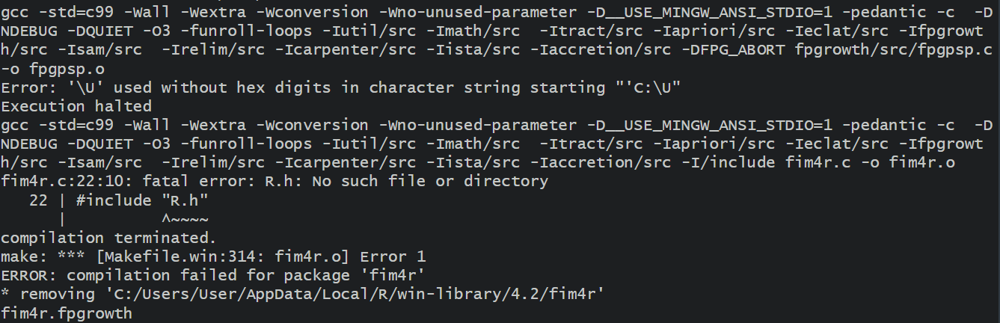
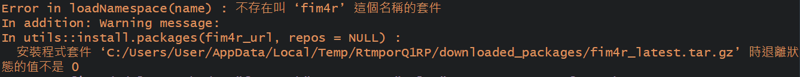

# Problem {-}
1. **arules::fim4r安裝問題** ([[compare different algorithm] mine rule of `AdultUCI` data set])

在第一次使用`fim4r`時會要求安裝，回答是或否以繼續。我好像沒辦法用，看起來是安裝路徑的問題，但是它要求安裝時沒有其他要求輸入的東西。

另外這個"C:\\U"的路徑問題是自從某次開RStudio後就有的，重新安裝也沒用，搜尋不到解決方法，替代方案是利用`file.edit(".Rprofile")`在工作目錄建立一個`.Rprofile`，再重啟R就不會有這個路徑問題。

2. **arules::apriori中的appearance問題** ([早餐店購買紀錄])

在早餐店購買紀錄的練習中，要注意關聯的右手邊不會有"性別"和"是否為學生"，因為這不是能被買甚麼早餐決定的，因此要設定appearance的參數。

但是經過設定後，被appearance使用到的變數不會出現在另一邊，詳細見練習題最後面的Notice部分